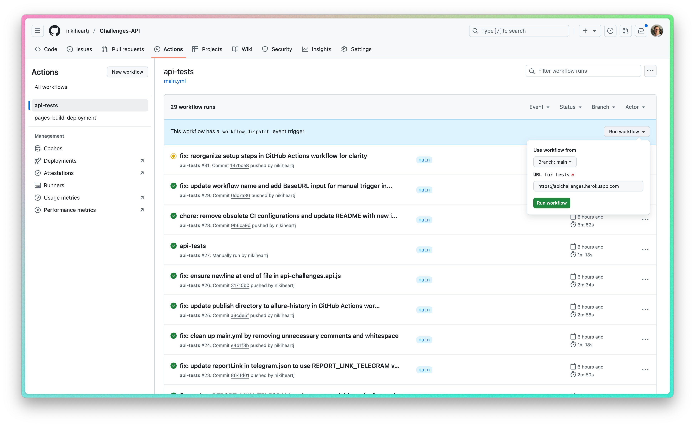

<h1 >Automation API project</h1>

## :bookmark_tabs: Сontent

- <a href="#tools">Technology Stack</a>

- <a href="#cases">Automated Checks</a>

- <a href="#console">Run tests from the command line</a>

- <a href="#github">Running tests in GitHub Actions</a>

- <a href="#jenkins">Running tests in Jenkins</a>

- <a href="#allure">Test reports in Allure Report</a>

- <a href="#testops">Integration with TestOps</a>

- <a href="#telegram">Notifications in Telegram using a bot</a>
  <a id="tools"></a>

## Technology Stack

| JavaScript                                                                                                    | VS Code                                                                                                                             | GitHub                                                                                                    | Playwright                                                                                                         | Allure                                                                                                          |                                                                                                        Telegram |
| :------------------------------------------------------------------------------------------------------------ | ----------------------------------------------------------------------------------------------------------------------------------- | --------------------------------------------------------------------------------------------------------- | ------------------------------------------------------------------------------------------------------------------ | --------------------------------------------------------------------------------------------------------------- | --------------------------------------------------------------------------------------------------------------- |
| <a href="https://nodejs.org/en"></a> | <a id ="tech" href="https://code.visualstudio.com/"></a> | <a href="https://github.com/"></a> | <a href="https://playwright.dev/"></a> | <a href="https://allurereport.org/"></a> | <a href="https://telegram.org/"></a> |

<a id="cases"></a>

## :ballot_box_with_check: Automated Checks

- :small_blue_diamond: Create X-Challenger token. @POST
- :small_blue_diamond: @GET the list of todos
- :small_blue_diamond: Create a todo with max out content. @POST
- :small_blue_diamond: Retrieve the current todos database for the user. @GET
- :small_blue_diamond: Full update a todo's fields via @PUT method
- :small_blue_diamond: @GET todos list with a query filter
- :small_blue_diamond: @DELETE a todo in the todos list

<a id="console"></a>

## :computer: Run tests from the command line

### Running tests locally

```
npm t
```

### Open allure-report locally

```
npm run open-report
```

<a id="github"></a>

## </a> Running tests in GitHub Actions

<p align="center">

<a href="https://jenkins.autotests.cloud/job/AD_demo_ui_steam/"></a>

> The workflow is configured for manual triggering via GitHub Actions, and you can always set up the relevant environment for your tests.

</p>

<a id="allure"></a>

## </a> Test reports in [Allure Report](https://nikiheartj.github.io/Challenges-API/26/index.html)

### Main window

<p align="center">

</p>

### Graphs window

<p align="center">

</p>

### Tests

> Each check is accompanied by a screenshot of the last action in the test, record & trace.

<p align="center">

</p>

<a id="telegram"></a>

## </a> Notifications in Telegram using a bot

<p >

</p>
